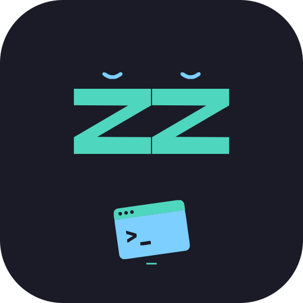
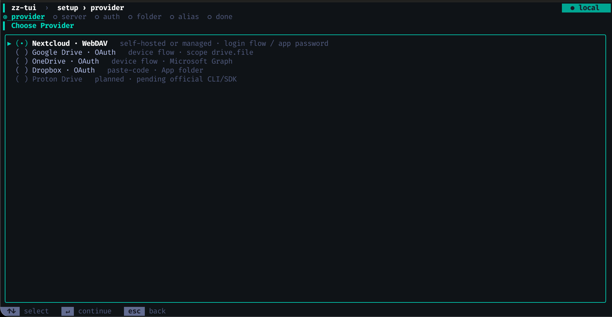
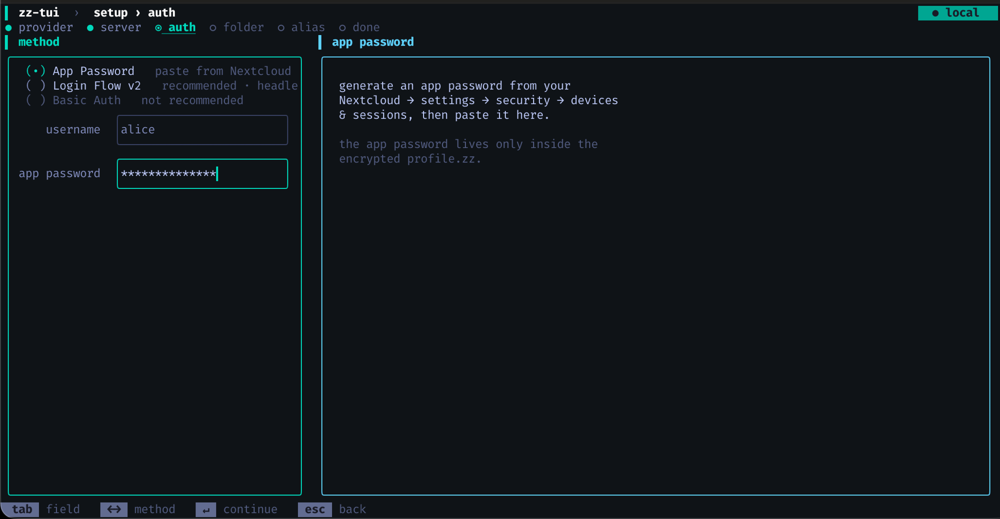
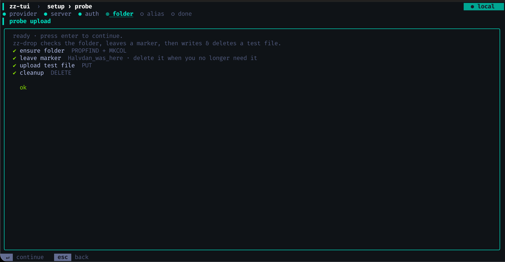

<p align="center">
  
</p>

# zz-drop

[](https://github.com/zz-drop/zz-drop/actions/workflows/build.yml)
[](https://github.com/zz-drop/zz-drop/releases)
[](https://github.com/zz-drop/homebrew-zz-drop)
[](#license)

Minimalist CLI to put files into — and get files from — a
configured safe cloud destination. Four providers, one command,
end-to-end encryption on every credential the tool stores.


zz-drop is **not** a sync tool, **not** a mount tool, **not** a
generic cloud file manager. One-shot uploads, one-shot downloads,
explicit, fast.

## Install

```bash
# macOS — Homebrew tap (preferred). Installs `zz-drop` + `zz-tui`,
# wires bash/zsh/fish completions, links `zz` to `zz-drop` if free.
brew install zz-drop/zz-drop/zz-drop

# Linux & WSL — signed binaries via curl-installer (preferred).
# Also works on macOS if you prefer no package manager.
curl -fsSL https://github.com/zz-drop/zz-drop/releases/latest/download/zz-drop-installer.sh | sh

# From source via the Rust toolchain (any OS rustup supports).
# No `zz` shorthand, no minisign verification — escape valve only.
cargo install --git https://github.com/zz-drop/zz-drop --locked zz-drop
```

No install path needs root.

Every release artifact from the brew + curl-installer channels is
signed with [minisign](https://jedisct1.github.io/minisign/);
the public key is [`release-key.pub`](release-key.pub).

Build from source with full control: see [`docs/build.md`](docs/build.md).

## Quickstart

```bash
zz c            # one-off setup (configuration TUI)
zz file.md      # upload
zz d file.md    # download
zz z            # unlock the agent for the session
zz q            # lock the agent
```

```text
$ zz readme.md
uploaded readme.md 12 KiB → casa-nc · cloud.example.org/zz-drop

$ zz d leggimi.txt
downloaded leggimi.txt 34 KiB ← casa-nc · cloud.example.org/zz-drop
```

Output always names the active alias and the destination. Sizes
are binary (`KiB` / `MiB` / `GiB`). Colors only on a TTY, with
`NO_COLOR` / `CLICOLOR=0` honored.

## Providers

| Provider | Auth method | Status |
|---|---|---|
| **Nextcloud** | WebDAV + App Password or Login Flow v2 | v1 ✓ |
| **Google Drive** | OAuth device flow, `drive.file` scope | v1 ✓ |
| **OneDrive** | OAuth device flow, Microsoft Graph | v1 ✓ |
| **Dropbox** | OAuth paste-code + PKCE, App folder | v1 ✓ |
| Proton Drive | — | planned v1.1+ |

## How it compares

| Tool | What it does | How zz-drop differs |
|---|---|---|
| [`rclone`](https://rclone.org/) | Swiss-army cloud engine — 50+ providers, two-way sync, mount, copy, serve, daemon | rclone is a many-verb daemon with a large config surface; zz-drop is the explicit one-shot transfer counterpart — single destination per profile, no sync, no mount, encrypted profile by default |
| [`croc`](https://github.com/schollz/croc) | Peer-to-peer ad-hoc transfer between two people via a relay | croc routes through a third-party relay between two parties; zz-drop deposits at your *own* cloud account, no relay |
| `scp` | SSH file copy to/from a host you have shell access on | scp needs SSH on the far end; zz-drop fronts WebDAV / GDrive / OneDrive / Dropbox — works against managed accounts where you don't have shell |

## What else is in the box

- **Encrypted profile container** (`profile-local.zz`):
  XChaCha20-Poly1305 + Argon2id; passphrase never leaves the
  device. The server side (when used in v2) sees only an
  opaque encrypted blob.
- **Local per-user agent** in the same binary: holds the
  decrypted profile in RAM only, TTL 10 min, idle locked-exit
  after 5 min, Unix socket bound per-UID.
- **Composable verb grammar** for power users:
  `zz sx file.md` (zstd compress), `zz sa dir/` (bulk
  top-level), `zz sar dir/` (recursive), `zz sarx dir/`
  (recursive + tar.zst). The `d` family mirrors it.

## TAB completion that knows your state

`zz` ships its own shell completion — SACS, state-aware
contextual suggestions. It doesn't just list verbs: it asks the
local agent for the *actual* state of your data and ranks
candidates accordingly.


`zz d <TAB>` shows remote files; `zz z <TAB>` shows the inner
profiles inside your unlocked container; `zz s <TAB>` falls
back to the local filesystem like every other CLI.

The script itself is tiny (~30 lines per shell); the brain is
the `zz` binary, so rebuilding the tool updates the suggestions
— the script never changes. zsh styling (group headers, menu
select, filename colors) is opt-in via six lines in `~/.zshrc`,
scoped to `zz` only so it leaves `git`, `ls`, `cd`'s TAB
behaviour untouched.

Brew install handles this for you. Manual install (other paths,
or to override):

```bash
zz --completions bash | source
zz --completions zsh  > ~/.zfunc/_zz       # then `compinit`
zz --completions fish > ~/.config/fish/completions/zz.fish
```

Full installation guide, zsh styling block and the
download-glob wrapper for `zz d 'Q*'`:
[`docs/sacs.md`](docs/sacs.md).

## TUI

The configuration TUI is a separate binary, `zz-tui`, shipped
in the same release tarball as `zz-drop`. `zz c` exec's it.

A typical Nextcloud setup, three screens of the six-step flow:

<table>
<tr>
<td></td>
<td></td>
<td></td>
</tr>
<tr>
<td align="center"><sub>1. pick a provider</sub></td>
<td align="center"><sub>2. authenticate</sub></td>
<td align="center"><sub>3. verify reachability</sub></td>
</tr>
</table>

Full walkthrough:


Use the TUI to:

- onboard a cloud destination (provider OAuth, Nextcloud Login
  Flow, or Nextcloud app-password)
- set or rotate the master passphrase
- add / remove inner profiles inside the container
- run diagnostics

The TUI is **setup-only**. Daily file moves stay in the CLI.

## Scripting

`zz` is scriptable. NDJSON on stdout, stable schema, no prompts,
no auto-unlock:

```sh
export ZZ_OUTPUT=json
export ZZ_PASSPHRASE_FILE=/run/secrets/zz.pass

zz z                        # unlock once
zz s artifact.zip           # upload
zz d 'reports/*.pdf' | jq -r 'select(.event=="downloaded").file'
```

Exit codes are stable, `reason` strings on `failed` records map
1:1 to them, and the full event schema lives in
[`docs/scriptable.md`](docs/scriptable.md) plus the JSON Schema
file at
[`docs/scriptable/zz-drop-output.v1.json`](docs/scriptable/zz-drop-output.v1.json).
`--quiet` is also available for terse human-readable output.

## Scope (v1)

In: explicit one-shot upload / download, one configured cloud
target per profile, the local agent, the configuration TUI.

Out: file sync, mount-as-FS, public share links, generic remote
file manager, team / org access.

The next features in flight are listed in the [project
roadmap](https://github.com/zz-drop).

## Documentation

- [`COMMANDS.md`](COMMANDS.md) — every command, examples,
  exit codes, parser rule
- [`docs/usage.md`](docs/usage.md) — worked examples for every
  verb, including scriptable mode patterns
- [`docs/scriptable.md`](docs/scriptable.md) — full `--json` /
  `--quiet` contract: NDJSON schema, reason table, CI cookbook
- [`SECURITY.md`](SECURITY.md) — threat model, server-side
  guarantees and non-claims, supported crypto
- [`docs/build.md`](docs/build.md) — build from source, BYO
  OAuth client IDs, shell completion install
- [`docs/agent.md`](docs/agent.md) — agent protocol, socket
  layout, token handshake, lock / TTL semantics
- [`docs/sacs.md`](docs/sacs.md) — state-aware completion
  internals
- [`docs/profile-format.md`](docs/profile-format.md) —
  `profile.zz` envelope and payload schema
- [`docs/providers/`](docs/providers/) — per-provider notes
  (Nextcloud, Google Drive, OneDrive, Dropbox)

## License

Dual: [MIT](LICENSE-MIT) OR [Apache-2.0](LICENSE-APACHE) at your
option.
